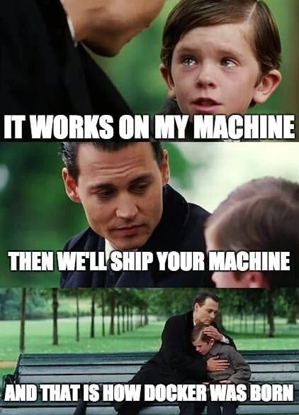

---
prev:
  text: '🌐 Professional Deployment'
  link: '/PHP/Part6'
next:
  text: '🐳 Docker: Orchestration'
  link: '/DEVOPS/Docker2'
---

# 🐳 DOCKER: MASTERING THE FUNDAMENTALS

## 🎯 General Objectives

- Understand **Docker** and **Docker Compose**, why they are important in modern software development.
- Master **core concepts** and **basic Docker commands**.
- Know how to **Dockerize** a simple application.
- Use **Docker Compose** to manage multi-container applications.
- Familiarize with basic **Linux commands** commonly used when working with Docker.
- Confidently apply Docker into **daily development workflow** to increase efficiency and consistency.

## 🎯 Specific Objectives (This Lesson)

- Understand the problem Docker solves.
- Distinguish between **Virtual Machines (VMs)** and **Containers**.
- Master core concepts: `Image`, `Container`, `Dockerfile`, `Registry`, `Docker Engine`.
- Proficient with basic `Docker CLI` commands to manage images and containers.
- Familiarize with basic `Linux` commands necessary when working with Docker, especially inside containers and writing Dockerfiles.
- Practice building the first `Dockerfile`, building an image, and running a `container` from that image.

## 1. 🌟 Introduction

### The "It works on my machine!" Problem

This is a "classic" saying in the programming world, reflecting a common problem:

- **Different environments:** App runs fine on dev's machine but fails when deployed to staging or production. Reasons can be different OS versions, missing or different library versions, inconsistent environment configurations (env variables, file paths).
- **Library conflicts (Dependency Hell):** Multiple apps on the same server might require different versions of the same library, leading to conflicts.
- **Difficult environment setup for newcomers:** Every time a new member joins the project, installing and configuring the development environment exactly like everyone else takes time and is error-prone.
- **Poor portability:** Moving app from one server to another, or from on-premise to cloud faces many obstacles.



### What is the solution? VMs vs Containers

To understand the difference between Virtual Machines (VMs) and Containers, we first need to grasp the concept of **Kernel**.

#### What is a Kernel?

- **Kernel (OS nucleus)** is the **heart** of an operating system. It is the core software layer managing hardware resources (CPU, RAM, disks, network devices) and providing basic services for all other programs running on it.
- When an application wants to perform a task like reading a file, sending data over network, or allocating memory, it doesn't do it directly but must go through **system calls** to the Kernel. The Kernel will handle that request.
  Great! Here is information about kernels of popular operating systems, presented in your requested format:
- **Kernels of popular operating systems:**

  - **Linux Kernel:**

    - **Origin & License:** Created by Linus Torvalds in 1991, inspired by MINIX (mini-Unix). Released under GPLv2 license (completely open source and free).
    - **Architecture:** Primarily **Monolithic**, but very **modular** with Loadable Kernel Modules (LKMs), allowing dynamic loading/unloading of drivers and features.
    - **Development Model:** Open development by a global community, under supervision of Linus Torvalds and key maintainers.
    - **Key Features:**
      - Extremely wide hardware support on many CPU architectures.
      - Very high flexibility and customizability.
      - Supports a large number of file systems (ext4, XFS, Btrfs, NTFS, FAT, etc.).
      - Uses traditional Unix process model (e.g., `fork()`, `exec()`).
    - **Main Applications:** Servers (web, database, cloud), desktops (via Linux distributions like Ubuntu, Fedora), embedded devices, supercomputers, and serves as the foundation for Android.

  - **Windows NT Kernel:**

    - **Origin & License:** (Formerly kernel for Windows NT OS, later became foundation for all modern Windows versions like Windows XP, Vista, 7, 8, 10, 11 and Windows Server versions). Developed by Microsoft, originated from ideas in VMS (Digital Equipment Corporation). Closed source, proprietary to Microsoft.
    - **Architecture:** **Hybrid**, combining a small microkernel (NT Executive) with many important system services (file management, network, graphics) running in kernel space for performance optimization.
    - **Development Model:** Closed development, internal by Microsoft engineers.
    - **Key Features:**
      - Wide software compatibility, especially games and desktop apps for PC.
      - Uses NTFS as main file system (also supports FAT/exFAT, ReFS).
      - Separate process and thread management model (e.g., `CreateProcess()`).
      - Strong support for enterprise services and Active Directory.
    - **Main Applications:** Personal computers (Windows 10, Windows 11), servers (Windows Server), Xbox gaming consoles, some embedded devices (Windows IoT).

  - **XNU Kernel:**
    - **Origin & License:** XNU stands for "X is Not Unix". Developed by Apple. Large parts of XNU source code are open (e.g., under Apple Public Source License - APSL, and parts under BSD license), however, the entire operating system (macOS, iOS,...) it serves is proprietary.
    - **Architecture:** **Hybrid**, based on **Mach microkernel** (from Carnegie Mellon University) for basic tasks like process management, virtual memory, and inter-process communication (IPC). Integrates components from **BSD** operating system (e.g., network stack, Virtual File System, some POSIX compatible system calls) running in same address space as Mach. I/O Kit manages device drivers.
    - **Development Model:** Primarily developed by Apple, though there are community contributions for open source parts of the kernel.
    - **Key Features:**
      - Tight integration with Apple-designed hardware, delivering optimal performance.
      - Provides POSIX compatible API through BSD layer.
      - Uses APFS (Apple File System) as main file system, previously HFS+.
      - Focuses on smooth user experience and security features.
      - Uses Kernel Extensions (KEXTs) for drivers, gradually moving to DriverKit (allowing drivers to run partially or fully in user space).
    - **Main Applications:** Personal computers (macOS), smartphones (iOS), tablets (iPadOS), smartwatches (watchOS), and Apple TV devices (tvOS).

- **Computer Boot Process Diagram:**
  (This diagram illustrates at which stage the Kernel is loaded and run)

  ```text
      +-------------------------+
      |   1. POWER ON           |
      |   (Press power button)  |
      +-------------------------+
                |
                V
      +---------------------------------------------------------------------+
      |   2. BIOS/UEFI RUNS (Firmware on Motherboard)                       |
      |       |                                                             |
      |       +-- a. Activate BIOS/UEFI from ROM chip                       |
      |       |                                                             |
      |       +-- b. POST (Power-On Self-Test)                              |
      |       |    (Check CPU, RAM, VGA, Keyboard...)                       |
      |       |    (-> Report errors if any)                                |
      |       |                                                             |
      |       +-- c. Initialize basic hardware devices                      |
      |       |                                                             |
      |       +-- d. Find Bootable Device                                   |
      |       |    (Configured order: HDD/SSD, USB, Network...)             |
      |       |                                                             |
      |       +-- e. Read MBR/ESP from Bootable Device                      |
      |            |                                                        |
      |            +--> Load BOOTLOADER into RAM                            |
      |                 (e.g., GRUB, Windows Boot Manager)                  |
      +---------------------------------------------------------------------+
                            |
                            V (Bootloader takes over)
      +---------------------------------------------------------------------+
      |   3. BOOTLOADER RUNS (In RAM)                                       |
      |       |                                                             |
      |       +-- a. (Optional) Show OS selection menu                      |
      |       |                                                             |
      |       +-- b. Load selected OS KERNEL into RAM                       |
      |       |    (From HDD/SSD)                                           |
      |       |                                                             |
      |       +-- c. (Optional) Load Initial RAM Disk (initrd/initramfs)    |
      |            (Contains temporary drivers for Kernel)                  |
      +---------------------------------------------------------------------+
                            |
                            V (Kernel takes over)
      +---------------------------------------------------------------------+
      |   4. KERNEL RUNS (In RAM)                                           |
      |       |                                                             |
      |       +-- a. Kernel decompresses and starts execution               |
      |       |                                                             |
      |       +-- b. Initialize Data Structures, more complex Device Drivers|
      |       |                                                             |
      |       +-- c. Mount Root Filesystem                                  |
      |       |                                                             |
      |       +-- d. Start INIT Process (PID 1)                             |
      |            (e.g., /sbin/init, systemd)                              |
      |            (This is the first process in User Space)                |
      +---------------------------------------------------------------------+
                            |
                            V (Init process takes over)
      +---------------------------------------------------------------------+
      |   5. OS BOOT COMPLETE                                               |
      |       |                                                             |
      |       +-- a. Init/systemd starts System Services                    |
      |       |    (Network, Logging, Display Manager...)                   |
      |       |                                                             |
      |       +-- b. Start User Interface (GUI or CLI)                      |
      |       |    (Login screen, Desktop Environment, Shell...)            |
      |       |                                                             |
      |       +-- c. Kernel fully operational, managing system              |
      |            |                                                        |
      |            +--> USER CAN USE COMPUTER                               |
      +---------------------------------------------------------------------+
  ```

#### How Virtual Machines (VMs) Work?

- Each VM runs a **complete Guest OS**, including its own **Kernel**.
- Example: You have a physical server running Linux (Host OS). You install a Hypervisor (like VMware, VirtualBox, KVM). On that Hypervisor, you can create:
  - A VM running Windows (with its own Windows Kernel).
  - Another VM running a different Ubuntu version (with its own Linux Kernel, different from Host OS Kernel or same version but independent).
- **VM Illustration:**

  ```text
        App A     |     App B
     (in VM1)     |  (in VM2)
    --------------|--------------
     Guest OS 1   |  Guest OS 2
    (Kernel G1)   |  (Kernel G2)
    ============================= Hypervisor
              Host OS
             (Kernel H)
    =============================
              Hardware
  ```

- This means VM1 and VM2 are completely isolated at Kernel level. Kernel G1 knows nothing about Kernel G2 or Kernel H.

> A virtual machine is like a detached house, with its own foundation, electricity, and water.

#### How Containers (Docker) Work: "Sharing Host OS Kernel"

- All containers running on the same server (Host OS) will **share a single Kernel, which is the Host OS Kernel.**
- Containers do not have their own Kernel. Instead, Docker Engine uses Host OS Kernel features (primarily **Namespaces** and **Control Groups - cgroups** on Linux) to create isolation for containers.
- **Container Illustration:**

  ```text
        App A    |     App B     |     App C
     (Container1)| (Container2)  | (Container3)
     Libs/Bins A | Libs/Bins B   | Libs/Bins C
    ------------------------------------------- Docker Engine
                    Host OS
                   (Kernel H)
    ===========================================
                    Hardware
  ```

> - Imagine an Apartment Building (Host OS):
>   - Containers = Apartments: Share foundation (Host Kernel), main utilities (Host OS services).
>   - Namespaces = Individual walls, doors: Apartment A doesn't see Apartment B's stuff (process, network, filesystem view isolation).
>   - Cgroups = Utility meters: Each apartment has limited resource usage (CPU, RAM).

- **This means:**

  - When an app inside Container 1 (e.g., an Nginx server) needs to open a network socket, it makes a system call. This system call is handled directly by the **Host OS Kernel**.
  - Similarly, when an app inside Container 2 (e.g., a Python app) needs to read a file, its system call is also handled by the **Host OS Kernel**.
  - Although sharing Kernel, containers remain isolated. Docker Engine, via Host Kernel, ensures that:
    - **Namespaces:** Container 1 doesn't "see" processes, network interfaces, or filesystem of Container 2 (and vice versa). Each container has its own "view" of the system, despite sharing the platform.
      - `PID namespace`: Each container has its own process tree, starting with PID 1.
      - `Network namespace`: Each container has its own network stack (IP, routing table, port).
      - `Mount namespace`: Each container has its own directory structure (filesystem).
      - `UTS namespace`: Each container has its own hostname.
      - `User namespace`: Maps user ID inside container to different user ID on host.
    - **Control Groups (cgroups):** Limits and monitors resources (CPU, RAM, I/O) each container can use. This prevents a "greedy" container from hogging system resources.

- **Consequences of Kernel Sharing:**

  - **Fast Startup:** Because it doesn't boot a whole new OS, container startup is nearly instant (just starting the app process).
  - **Lighter:** No resource overhead (CPU, RAM, disk) for separate Guest OS, only for the app and its libraries.
  - **Higher Density:** Can run more containers on same host compared to VMs.
  - **Compatible Kernel Requirement:** Because of kernel sharing, you cannot run a Linux container directly on a Windows Kernel (and vice versa) _natively_.
    - _Note:_ Docker Desktop on Windows or macOS actually runs a small Linux VM underneath to run Linux containers. In that case, those Linux containers share that Linux VM's Kernel, not Windows/macOS Kernel.

#### Comparing VMs and Containers

| Feature          | Virtual Machines (VMs)                                                                                                                                                       | Containers (Docker)                                                                                  |
| :--------------- | :--------------------------------------------------------------------------------------------------------------------------------------------------------------------------- | :--------------------------------------------------------------------------------------------------- |
| **Isolation**    | **OS Level**: Each VM has a separate Guest OS and Kernel, completely isolated from Host OS and other VMs.                                                                    | **Process Level**: Containers share Host OS Kernel. Isolated at process, filesystem, network level.  |
| **Overhead**     | **High**: Each VM needs resources (RAM, CPU, Disk) for Guest OS, wasteful if running just a small app.                                                                       | **Low**: Only consumes resources for the app and its dependencies, no separate Guest OS needed.      |
| **Startup Time** | **Slow (minutes)**: Must boot an entire Guest OS.                                                                                                                            | **Fast (seconds)**: Just needs to start the app process.                                             |
| **Portability**  | **Fair**: VM images are usually large (GBs), moving and managing is more complex.                                                                                            | **Very High**: Container images are much smaller (MBs to few hundred MBs), easy to move and share.   |
| **Density**      | **Low**: Number of VMs on a host is limited by resources needed for Guest OS.                                                                                                | **High**: Can run many more containers on same host due to low overhead.                             |
| **Use Case**     | Need running completely different OS on same host (e.g., Windows on Linux). Require distinct kernel security level. Running "legacy" apps not easily containerized.          | Packaging and running apps, microservices, CI/CD pipelines, consistent dev environments.             |

---

**Docker is a containerization platform** helping package application and all its dependencies (libraries, runtime, system tools, code) into a standardized, portable unit called a **container**. This container can run consistently on any machine with Docker installed, regardless of underlying environment.

## 2. 🐧 Basic Linux For Docker

### Why know basic Linux?

- **Base Images:** Most popular Docker images (e.g., `ubuntu`, `alpine`, `centos`, `node`, `python`, `nginx`) are built based on Linux distributions.
- **Dockerfile Instructions:** Many commands in `Dockerfile` (like `RUN`) are actually Linux shell commands to install software, configure, etc.
- **Interacting with Containers:** When you need to debug or check a running container, you often `exec` into that container and use Linux commands to view logs, check files, processes.

Understanding some basic Linux commands will help you work with Docker much more effectively.

### Navigation & File/Directory Management

- `pwd` (print working directory): Show current working directory.
  - _Example:_ `pwd` -> `/app`
- `ls` (list): List files and directories in current directory (or specified directory).
  - `ls -l`: Detailed view (permissions, owner, size, modified date).
  - `ls -a` or `ls -A`: Show hidden files/dirs (starting with `.`, `-A` excludes `.` and `..`).
  - `ls -lh`: Detailed view with human-readable sizes (KB, MB, GB).
  - _Example:_ `ls -lha /var/log`
- `cd <directory>` (change directory): Change to specified directory.
  - `cd ..`: Go up one level.
  - `cd ~` or `cd`: Go to current user's home directory.
  - `cd -`: Go back to previous directory.
  - _Example:_ `cd /etc/nginx`
- `mkdir <directory_name>` (make directory): Create new directory.
  - `mkdir -p /path/to/nested/directory`: Create parent directories if not exist.
  - _Example:_ `mkdir my_project`
- `touch <file_name>`: Create empty file if not exist, or update access/modified timestamp if exists.
  - _Example:_ `touch app.log`
- `rm <file_name>` (remove): Remove file.
  - `rm -r <directory_name>`: Remove directory and contents recursively. **CAREFUL!**
  - `rm -f <file_name>`: Force remove file without confirmation.
  - `rm -rf <directory_name>`: Force remove directory and contents. **VERY CAREFUL! This can wipe data if misused.**
  - _Example:_ `rm old_log.txt`, `rm -rf temp_files/`
- `cp <source> <destination>` (copy): Copy file or directory.
  - `cp file1.txt file2.txt`: Copy `file1.txt` to `file2.txt`.
  - `cp -r <source_dir> <destination_dir>`: Copy directory recursively.
  - _Example:_ `cp config.yaml /app/config/`, `cp -r public_html/* /var/www/html/`
- `mv <source> <destination>` (move): Move or rename file/directory.
  - `mv old_name.txt new_name.txt`: Rename file.
  - `mv file.txt /tmp/`: Move file to `/tmp`.
  - _Example:_ `mv app.log app.log.bkp`, `mv build_output /opt/app`

### Basic Permissions

Using `ls -l`, you see permission info like `drwxr-xr--`:

- First char: `d` (directory), `-` (file), `l` (symbolic link).
- Next 3 groups (each 3 chars `rwx`):
  1. **User (Owner):** Owner permissions.
  2. **Group:** Group permissions.
  3. **Others:** Others permissions.
- `r`: read, `w`: write, `x`: execute.

- `chmod <permissions> <file/directory>`: Change permissions.
  - Numeric (octal): `r=4, w=2, x=1`. E.g., `chmod 755 script.sh` (owner: rwx=7, group: r-x=5, others: r-x=5).
  - Symbolic: `u` (user), `g` (group), `o` (others), `a` (all); `+` (add), `-` (remove), `=` (set).
  - _Example:_ `chmod +x script.sh` (add execute to owner, group, others).
  - _Example:_ `chmod u+x script.sh` (add execute to owner only).
  - _Example:_ `chmod 600 private_key.pem` (owner: rw-, group/others: ---).
- `chown <user>:<group> <file/directory>`: Change owner and group.
  - _Example:_ `chown www-data:www-data /var/www/html` (common for web server).

### Other Useful Commands

- `cat <file_name>`: View whole file content.
  - `cat file1.txt file2.txt > combined.txt`: Concatenate file1 and file2 to combined.txt.
- `less <file_name>` or `more <file_name>`: View file page by page (space to scroll, `q` to quit). `less` is more flexible.
- `head <file_name>`: View first 10 lines.
  - `head -n 20 <file_name>`: View first 20 lines.
- `tail <file_name>`: View last 10 lines.
  - `tail -n 20 <file_name>`: View last 20 lines.
  - `tail -f <file_name>`: Follow file, showing new lines added (useful for logs).
- `echo "text"`: Print text to screen.
  - `echo "text" > file.txt`: Write text to file (overwrite or create).
  - `echo "text" >> file.txt`: Append text to file.
  - _Example:_ `echo "API_KEY=12345" > .env`
- `grep "pattern" <file_name>`: Search for "pattern" in file.
  - `grep -i "error" app.log`: Search "error" case-insensitive.
  - `grep -r "config_value" /etc/`: Recursive search in `/etc`.
  - `ps aux | grep nginx`: Find process named `nginx`.
- `find <directory> -name "<pattern>"`: Find files/directories.
  - _Example:_ `find /app -name "*.js"` (find all .js files in /app).
  - _Example:_ `find . -type f -mtime -7` (find files modified in last 7 days).
- `df -h` (disk free): Show free disk space (human-readable).
- `du -sh <directory/file>` (disk usage): Show usage of file/dir (`-s` summary).
- `ps aux`: List all running processes.
- `top` or `htop`: Real-time view of processes and system resources. `htop` is friendlier.
- `kill <pid>`: Send signal (default TERM) to stop process (PID is Process ID).
  - `kill -9 <pid>`: Force kill (SIGKILL).
- `which <command_name>`: Show full path of command.
  - _Example:_ `which python` -> `/usr/bin/python`
- `man <command_name>`: Show manual page of command.
- `sudo <command>`: Execute command as superuser (root). Needed for admin tasks.

### Package Managers

Used in `Dockerfile` to install software.

- Debian/Ubuntu: `apt-get update`, `apt-get install <package>`, `apt-get remove <package>`.
  - Example: `RUN apt-get update && apt-get install -y curl vim`
  - `-y`: auto answer yes.
- Alpine Linux: `apk update`, `apk add <package>`, `apk del <package>`. (Alpine preferred for small images).
  - Example: `RUN apk add --no-cache curl`
  - `--no-cache`: don't save cache, smaller image.
- CentOS/RHEL/Fedora: `yum install <package>` (older) or `dnf install <package>`.
  - Example: `RUN yum install -y httpd`

## 3. 💡 Docker Core Concepts

### Docker Overview Architecture

```text
+----------------------+                          +------------------------------------------------------------+                         +-----------------------+
|                      | --- Command (build, run)->|                      DOCKER HOST                           |                         |                       |
|    DOCKER CLIENT     |                          |  +------------------------------------------------------+  |<---- Pull --------------|       REGISTRY        |
|  (e.g., `docker` CLI)|                          |  |                  Docker Daemon                       |  |                         |  (e.g., Docker Hub,   |
|  (You interact here) |                         |  |                   (`dockerd`)                        |  |---- Push --------------->|  AWS ECR, Google GCR) |
|                      | <-- Info, results -------|  |        (Listens API, Manages Objects)                |  |                         |                       |
+----------------------+                          |  +-----------------------▲--┬---------------------------+  |                         +-----------------------+
                                                  |                          |  |                              |
                                                  | (Download Images         |  | (Run Containers from Images) |
                                                  |  Store Images local)     |  | (Build Images from Dockerfile)|
                                                  |                          |  |                              |
                                                  |  +-----------------------┴--▼---------------------------+  |
                                                  |  |       IMAGES            |       CONTAINERS           |  |
                                                  |  | (Templates Read-Only)   | (Running Instances)        |  |
                                                  |  |  - ubuntu:latest        |  - my_app_container        |  |
                                                  |  |  - nginx:alpine         |  - db_container            |  |
                                                  |  |  - my_custom_app:v1     |  - ...                     |  |
                                                  |  +-------------------------+----------------------------+  |
                                                  +------------------------------------------------------------+
```

### Docker Engine

Docker Engine is the core of Docker, working on client-server architecture:

```text
  +-----------------+      +-----------------+      +-------------------------+
  |      User       |----->|   Docker CLI    |----->|        REST API         |<---+ (Communicates via socket)
  +-----------------+      |   (`docker`)    |      +-------------------------+    |
                           +-----------------+                                     |
                                                      Docker Daemon (`dockerd`)    |
                                +--------------------------------------------------+
                                |                 "Heart of Docker" 🧠             |
                                |  - Background process on Host OS.                |
                                |  - Listens to requests from Docker API.          |
                                |  - Manages Docker objects: Images,               |
                                |    Containers, Networks, Volumes.                |
                                |  - Interacts with Host OS Kernel to create       |
                                |    and manage container isolation.               |
                                +--------------------------------------------------+
```

- **Docker Daemon (`dockerd`)**:
  - A persistent background service on host machine.
  - The "Brain" 🧠 or "Heart" of Docker, doing the heavy lifting.
  - Listens to Docker API requests (usually via Unix socket or network interface).
  - Manages lifecycle of Docker objects:
    - Build images from Dockerfiles.
    - Pull images from registries.
    - Push images to registries.
    - Create, run, stop, delete containers.
    - Manage networks for container communication.
    - Manage volumes for persistent storage.
- **REST API**:
  - A standardized interface that programs (like Docker CLI) use to "talk" to Docker Daemon.
  - Allows automation and integration of Docker with other tools.
- **Docker CLI (`docker`)**:
  - Main Command Line Interface users interact with.
  - When you type `docker run`, `docker ps`, `docker build`, etc., CLI translates it to an API request sent to Docker Daemon.
  - Daemon processes request and CLI shows result.
  - CLI can communicate with local or remote Daemon.

### Image

- A **read-only template** (cannot change after creation). It's like a blueprint, mold, or "snapshot" 📸 of a mini file system, pre-configured.
- Contains everything needed to run an app:
  - App source code (or compiled version).
  - Runtime (e.g., Node.js, Python interpreter, JRE).
  - System libraries and app dependencies.
  - Environment variables.
  - Default config files.
  - Metadata (exposed ports, default command).
- Images are built in **layers**. Each instruction in `Dockerfile` (learned later) creates a new layer, stacked on previous ones.

  ```text
  +------------------------------------+  Layer N (e.g., Default CMD)
  |         Default Command            |
  +------------------------------------+
  |        COPY your_app_code          |  Layer N-1 (Your app source code)
  +------------------------------------+
  |        RUN npm install             |  Layer N-2 (Install dependencies)
  +------------------------------------+
  |        COPY package.json ./        |  Layer N-3
  +------------------------------------+
  |              ...                   |  ...
  +------------------------------------+
  |   FROM node:18-alpine (Base Image) |  Layer 1 (Node & Alpine base layers)
  +------------------------------------+
  ==> Final Image (read-only)
  ```

- **Benefits of layers:**
  - **Reusability**: Common layers (base OS, runtime) shared between images, saving disk space.
  - **Storage Efficiency**: Only delta (change) stored per layer. Shared layers stored once.
  - **Faster Builds**: Docker caches unchanged layers. Changing top layer only rebuilds from there.
  - **Efficient Transfers**: Pull/push only sends layers missing locally/remotely.

### Container

- A **runnable instance** of an Image. Like an object created from a class in OOP.
- When "running" an Image (`docker run`), Docker Engine creates a Container from it.
- You can create, start, stop, move, and delete Containers.
- Each Container is an **isolated** and **ephemeral** environment (unless volumes used):
  - Own file system (from image layers + writable top layer).
  - Own process namespace (doesn't see host/other container processes).
  - Own network interface (own IP in Docker network).
  - Isolated from other Containers and Host.
  - Yet, all Containers on host **share Host OS kernel**. Main difference from VM.
- **State:** A container can be created, running, paused, exited, dead.

```text
+-----------------------+         +-----------------------+
|     Image: my_app     |         |     Image: database   |
|  (Template Read-Only) |         |  (Template Read-Only) |
|  (Layers: OS, Runtime,|         |  (Layers: OS, DB Eng, |
|   Libs, App Code)     |         |   Config)             |
+-----------------------+         +-----------------------+
          |                                  |
          | .------------ `docker run` ------------. |
          V                                  V
+--------------------------------+  +--------------------------------+
|  Container A (my_app_instance1)|  | Container B (db_instance1)     |
|  (Image Layers + Writable Layer)|  | (Image Layers + Writable Layer)|
|  - Own Filesystem view         |  |  - Own Filesystem view         |
|  - Own Process space           |  |  - Own Process space           |
|  - Own Network Interface       |  |  - Own Network Interface       |
+--------------------------------+  +--------------------------------+

On same Host Machine (sharing Host OS Kernel)
```

### Dockerfile

- A simple **text file**, no extension (conventionally named `Dockerfile`).
- Contains a series of **instructions** Docker Engine reads and executes sequentially to automatically **build** a Docker Image.
- Like a "script", "recipe", or "blueprint" to create Image.
- Each instruction usually creates a new layer.
- **Workflow:**
  `Dockerfile` --(Input for `docker build . -t my_image_name`)--> `Image` 🖼️

### Registry (Docker Hub)

- A centralized **repository** and distribution system for Docker Images.
- Allows storing (push), managing, searching, and sharing (pull) Images.
- **Docker Hub**:
  - Largest default **public** registry. Hosted by Docker, Inc.
  - Contains thousands of pre-built Images (e.g., `ubuntu`, `nginx`, `python`, `mysql`, `node`).
  - Create free account to push your Images (public or private limit).
- **Private Registries**:
  - Self-host registry (e.g., Docker Registry image, Harbor) for security/control.
  - Cloud providers offer private registries:
    - Amazon ECR (Elastic Container Registry)
    - Google GCR (Google Container Registry) / Artifact Registry
    - Azure ACR (Azure Container Registry)
    - GitHub Container Registry
- **Basic Registry Commands:**

  - `docker login [SERVER_ADDRESS]`: Login to registry. Default Docker Hub.
  - `docker pull <image_name>:<tag>`: Download Image from Registry.

    - _Example:_ `docker pull ubuntu:22.04`

    ```text
    [Local Machine] <--- (docker pull ubuntu:22.04) --- [☁️ Docker Hub / Other Registry]
    ```

  - `docker push <username>/<image_name>:<tag>`: Upload Image to Registry (after proper tagging).

    - _Example:_ `docker push mydockerhubuser/my-custom-app:1.0`

    ```text
    [Local Machine] --- (docker push myuser/myimage:v1) ---> [☁️ Docker Hub / Other Registry]
    ```

  - `docker search <keyword>`: Search image on Docker Hub.

  ```text
                             +----------------------------+
                             | Docker Hub / Private Registry|
                             | (e.g., ECR, GCR, Harbor)   |
                             +-----------┬----------------+
                                         |
                      docker pull <image>|  docker push <your_repo/image>
                                         |
                   ┌─────────────────────┴─────────────────────┐
                   │                                           │
                   ▼                                           ▲
      +---------------------------+               +---------------------------+
      |      Local Machine 1      |               |      Local Machine 2      |
      | (Dev Laptop, CI Server)   |               | (Production Server, Staging)|
      +---------------------------+               +---------------------------+
  ```

## 4. ⚙️ Basic Docker CLI

General syntax: `docker [OPTIONS] COMMAND [ARGUMENTS...]`
To see all commands: `docker --help` or `docker COMMAND --help` (e.g., `docker run --help`).

### Image Management

- `docker images` or `docker image ls`: List all local images.
  - `docker images -q`: Show only Image IDs.
- `docker pull <image_name>:<tag>`: Download image from registry (default Docker Hub).
  - `<tag>` specifies version. Default `:latest`.
  - Example: `docker pull nginx:latest`
  - Example: `docker pull ubuntu:20.04`
- `docker rmi <image_id_or_name:tag>`: Remove image(s) from local.
  - Image must not be used by any container (even stopped).
  - `docker rmi -f <image_id>`: Force remove (not recommended).
  - `docker rmi $(docker images -q -f dangling=true)`: Remove dangling images (untagged, unused intermediates).
- `docker build -t <image_name>:<tag> <path_to_dockerfile_directory>`: Build image from Dockerfile.
  - `-t`: Tag image with name/version (e.g., `myapp:1.0`).
  - `.`: Current directory as build context.
  - Example: `docker build -t my-custom-app:v1.0 .`
- `docker history <image_name:tag>`: Show image layers/history.
- `docker inspect <image_name:tag_or_id>`: Show detailed image info (JSON).
- `docker tag <source_image_id_or_name:tag> <target_image_name:tag>`: Add tag to image. Often for pushing (e.g., `docker tag myapp:1.0 myusername/myapp:1.0`).

### Container Management

- `docker run [OPTIONS] <image_name>:<tag> [COMMAND] [ARG...]`: Create and run new container from image. Pulls if missing locally.
  - `docker run hello-world`: Simple test.
  - **Common Options:**
    - `-d` (detached): Run background, print ID.
    - `-p <host_port>:<container_port>` (port mapping): Map host port to container port.
      - Example: `-p 8080:80` (localhost:8080 -> container:80).
    - `--name <container_name>`: Name container. Random if unset.
    - `-it` (interactive + TTY): Interactive mode with terminal.
      - `-i`: Keep STDIN open.
      - `-t`: Allocate pseudo-TTY.
    - `--rm`: Auto-remove container on exit. Good for one-off tasks.
    - `-v <host_path>:<container_path>` (volume mapping): Mount host dir/file to container.
    - `-e <KEY>=<VALUE>` (env variable): Set env var.
    - `--network <network_name>`: Connect to specific network.
  - **Examples:**
    - `docker run -d -p 8080:80 --name my_web_server nginx`
    - `docker run -it --rm ubuntu bash` (Bash shell in Ubuntu, auto-delete on exit)
- `docker ps`: List running containers.
  - `docker ps -a`: List all containers (running & stopped).
  - `docker ps -q`: Show only IDs.
- `docker stop <container_id_or_name>`: Stop running container(s) (SIGTERM -> SIGKILL).
- `docker start <container_id_or_name>`: Start stopped container(s).
- `docker restart <container_id_or_name>`: Restart container.
- `docker rm <container_id_or_name>`: Remove stopped container(s).
  - `docker rm -f <container_id_or_name>`: Force remove running container (SIGKILL).
  - `docker container prune`: Remove all stopped containers. Confirm `y`.
  - `docker rm $(docker ps -aq -f status=exited)`: Remove all exited containers.

### Interacting with Container

- `docker logs <container_id_or_name>`: View logs (STDOUT/STDERR).
  - `docker logs -f <container_id_or_name>`: Follow logs.
  - `docker logs --tail 50 <container_id_or_name>`: Last 50 lines.
- `docker exec [OPTIONS] <container_id_or_name> <command>`: Run command inside **running** container.
  - `-it`: Interactive shell.
  - Example: `docker exec -it my_web_server bash` (bash shell inside `my_web_server`).
  - Example: `docker exec my_db_container psql -U user -d dbname -c "SELECT * FROM users;"`
- `docker cp <host_path> <container_id_or_name>:<container_path>`: Copy from host to container.
  - Example: `docker cp ./config.json my_app_container:/app/config.json`
- `docker cp <container_id_or_name>:<container_path> <host_path>`: Copy from container to host.
  - Example: `docker cp my_log_container:/app/logs/error.log ./`
- `docker attach <container_id_or_name>`: Attach terminal to running container's IO. **Note:** Ctrl+C might stop container. `docker exec` is safer.

### Inspecting and Cleaning

- `docker inspect <container_id_or_name_or_image_id>`: Detailed JSON info.
- `docker top <container_id_or_name>`: Running processes inside container.
- `docker stats [container_id_or_name...]`: Real-time resource usage stats.
- **Cleaning unused resources:**
  - `docker system df`: Disk usage.
  - `docker system prune`: Remove stopped containers, unused networks, dangling images, build cache.
    - `docker system prune -a`: Also remove unused images (not just dangling).
    - `docker system prune --volumes`: Also remove unused volumes (careful!).
  - `docker image prune`: Remove dangling images.
    - `docker image prune -a`: Remove all unused images.
  - `docker container prune`: Remove stopped containers.
  - `docker volume prune`: Remove unused local volumes.
  - `docker network prune`: Remove unused networks.

## 5. 📝 Dockerfile: Recipe for Images

`Dockerfile` is a text file without extension, default name `Dockerfile`. Contains instructions for Docker to auto-build an image.

### Common Instructions

Each usually creates a new layer.

1. **`FROM <image>:<tag>` or `FROM <image>@<digest>`**

   - **Purpose:** Base image.
   - **Note:** _First instruction_ (except `ARG` before).
   - Use specific tag (e.g., `ubuntu:22.04`) for reproducibility. Digest (`sha256:...`) for maximum reliability.
   - Example: `FROM node:18-alpine`

2. **`LABEL <key>=<value> ...`**

   - **Purpose:** Metadata (e.g., maintainer, version).
   - Example: `LABEL maintainer="email@example.com"`

3. **`ARG <name>[=<default_value>]`**

   - **Purpose:** Build-time variable.
   - Pass via `docker build --build-arg <name>=<value>`.
   - Example: `ARG APP_VERSION=1.0.0`

4. **`ENV <key>=<value> ...`**

   - **Purpose:** Environment variable (build & runtime).
   - Can be overridden at runtime (`docker run -e`).
   - Example: `ENV NODE_ENV=production`

5. **`WORKDIR /path/to/workdir`**

   - **Purpose:** Set working directory for subsequent `RUN`, `CMD`, `ENTRYPOINT`, `COPY`, `ADD`.
   - Created if missing. Use absolute path.
   - Example: `WORKDIR /app`

6. **`COPY [--chown=<user>:<group>] <src>... <dest>`**

   - **Purpose:** Copy files/dirs from build context to image.
   - `<src>` relative to context. `<dest>` absolute or relative to `WORKDIR`.
   - No URL/auto-extraction.
   - Example: `COPY . .`, `COPY package.json ./`

7. **`ADD [--chown=<user>:<group>] <src>... <dest>`**

   - **Purpose:** Like `COPY` but handles URLs and auto-extracts tarballs.
   - **Recommendation:** Prefer `COPY`. Use `ADD` only if needed features.
   - Example: `ADD https://example.com/file.zip /app/`

8. **`RUN <command>` (shell) or `RUN ["exec", "param"]` (exec)**

   - **Purpose:** Execute command in new layer, commit result.
   - Install packages, build code, etc.
   - Combine commands with `&&` to reduce layers.
   - Example: `RUN apt-get update && apt-get install -y nginx`

9. **`EXPOSE <port> ...`**

   - **Purpose:** Metadata indicating listening ports.
   - **Does NOT** publish port to host. Use `-p` at runtime.
   - Example: `EXPOSE 80`

10. **`CMD ["exec","param"]` (exec - preferred)**

    - `CMD command param` (shell)
    - **Purpose:** Default command/args when container starts.
    - **Note:** Only last `CMD` matters. Overridable by `docker run` args.
    - Example: `CMD ["node", "server.js"]`

11. **`ENTRYPOINT ["exec","param"]` (exec - preferred)**

    - **Purpose:** Configure container as executable. Always runs.
    - **Difference:** `docker run` args appended to `ENTRYPOINT`. Harder to override (`--entrypoint`).
    - Example: `ENTRYPOINT ["java", "-jar", "/app.jar"]`

12. **`VOLUME ["/path"]`**

    - **Purpose:** Create mount point for persistent data.
    - Creates anonymous volume if not mapped at runtime.
    - Example: `VOLUME /var/lib/mysql`

13. **`USER <user>`**

    - **Purpose:** Set user for subsequent commands and runtime.
    - **Best Practice:** Non-root user for security.
    - Example: `RUN adduser -D myuser && USER myuser`

14. **`ONBUILD <INSTRUCTION>`**

    - **Purpose:** Trigger instruction when image used as base.

15. **`HEALTHCHECK [OPTIONS] CMD <command>`**

    - **Purpose:** Check container health.
    - Example: `HEALTHCHECK CMD curl -f http://localhost/ || exit 1`

16. **`SHELL ["executable", "parameters"]`**
    - **Purpose:** Change default shell.

### Simple Dockerfile Example (Node.js)

Structure:

```text
my-node-app/
├── Dockerfile
├── package.json
├── server.js
└── ...
```

`package.json`:

```json
{
  "name": "my-node-app",
  "version": "1.0.0",
  "main": "server.js",
  "scripts": {
    "start": "node server.js"
  },
  "dependencies": {
    "express": "^4.17.1"
  }
}
```

`Dockerfile`:

```dockerfile
# 1. Base image
FROM node:18-alpine

# Metadata
LABEL maintainer="email@example.com"

# 2. Working directory
WORKDIR /usr/src/app

# 3. Copy package files first (caching)
COPY package*.json ./

# 4. Install dependencies
RUN npm install --production

# 5. Copy source code
COPY . .

# 6. Env var
ENV NODE_ENV=production
ENV PORT=3000

# 7. Expose port
EXPOSE ${PORT}

# 8. Start command
CMD [ "node", "server.js" ]
```

**Build:**

```bash
cd /path/to/my-node-app
docker build -t my-node-app:1.0 .
```

### Order & Caching

- Docker caches layers. If instruction + files unchanged -> use cache.
- **Cache miss -> all subsequent layers rebuilt.**
- **Order matters:** Least changing first. Dependencies before source code.

**`.dockerignore`:** Exclude files from context. Speeds up build, reduces size/cache busting.

```text
node_modules
npm-debug.log
.git
.env
```

## 6. 🛠️ Practice: Dockerize PHP "Hello World" with Apache

Goal: Serve `index.php` using Apache + PHP via Dockerfile.

1. **Create directory & `index.php`:**

   ```bash
   mkdir php-hello-docker && cd php-hello-docker
   ```

   `index.php`:

   ```php
   <!-- index.php -->
   <!DOCTYPE html>
   <html lang="en">
     <head>
       <meta charset="UTF-8" />
       <title>Hello PHP Docker!</title>
       <style>
         body { font-family: sans-serif; text-align: center; padding: 50px; background: #f0f0f0; }
         h1 { color: #333; }
       </style>
     </head>
     <body>
       <h1>Hello from PHP inside Docker! 🐘</h1>
       <p>PHP Version: <?php echo phpversion(); ?></p>
     </body>
   </html>
   ```

2. **Create `Dockerfile`:**

   ```dockerfile
   # 1. Official PHP Apache image
   FROM php:8.3-apache

   # 2. Copy index.php to Apache document root
   COPY ./index.php /var/www/html/index.php

   # 3. Expose port 80 (metadata)
   EXPOSE 80
   ```

3. **Build Image:**

   ```bash
   docker build -t my-first-php-app:1.0 .
   ```

   Check: `docker images`

4. **Run Container:**

   ```bash
   docker run -d -p 8080:80 --name web_test_php my-first-php-app:1.0
   ```

   Check: `docker ps`

5. **Verify:**
   Browser: `http://localhost:8080`

6. **Logs:**

   ```bash
   docker logs web_test_php
   ```

7. **Cleanup:**

   ```bash
   docker stop web_test_php
   docker rm web_test_php
   # docker rmi my-first-php-app:1.0
   ```

Congratulations! First PHP app Dockerized.

**Notes:**

- **Nginx + PHP-FPM:** More complex (separate containers or multi-process container). Advanced topic.
- **PHP Version:** Change tag `php:8.2-apache` etc.

## 7. 🏋️ Advanced Practice: Dockerize Dynamic PHP App with Env Config

**Task:** Dockerize PHP app configurable via environment variables.

**Goals:**

- Understand dynamic app Dockerization.
- Practice environment variables.
- Intro to file handling/permissions.
- Intro to stateful apps & volumes.