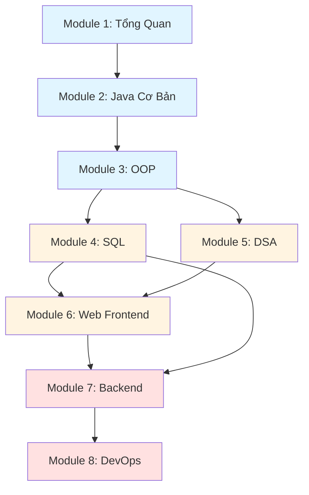

## 🎓 Lộ Trình Học Khuyến Nghị

### 🌟 Giai đoạn 1: Nền Tảng (Foundation)

**Mục tiêu:** Xây dựng tư duy lập trình và kỹ năng cơ bản

#### 📚 Module 1: Tổng Quan & Kỹ Năng Học Tập

Làm quen với lập trình, hiểu cách thức hoạt động của máy tính và phát triển kỹ năng tự học.

- **Nội dung:**
  - Giới thiệu về lập trình và ngôn ngữ lập trình
  - Kiến trúc máy tính, hệ điều hành và mạng cơ bản
  - Kỹ năng tìm kiếm thông tin và tự học hiệu quả
  - Cài đặt môi trường phát triển
- **Thời lượng:** 1-2 tuần

[Bắt đầu →](/INTRODUCTION) | [Kỹ năng tự học →](/SELF-LEARNING/Part1)

#### 📚 Module 2: Lập Trình Cơ Bản với Java

Học ngôn ngữ lập trình đầu tiên với Java - ngôn ngữ phổ biến, cú pháp rõ ràng và hỗ trợ OOP tốt.

- **Nội dung:**
  - Cú pháp cơ bản: biến, kiểu dữ liệu, toán tử
  - Cấu trúc điều khiển: if-else, switch, vòng lặp
  - Mảng và chuỗi
  - Hàm/phương thức
- **Thời lượng:** 3-4 tuần
- **Tiên quyết:** Module 1

[Học Java cơ bản →](/JAVA/Part1)

#### 📚 Module 3: Lập Trình Hướng Đối Tượng (OOP)

Nắm vững tư duy OOP - nền tảng quan trọng của lập trình hiện đại.

- **Nội dung:**
  - Class và Object
  - Tính đóng gói, kế thừa, đa hình, trừu tượng
  - Interface và Abstract class
  - Exception handling
- **Thời lượng:** 2-3 tuần
- **Tiên quyết:** Module 2

[Học OOP →](/JAVA/Part2)

### 🚀 Giai đoạn 2: Phát Triển (Development)

**Mục tiêu:** Xây dựng ứng dụng thực tế với database và web

#### 📚 Module 4: Cơ Sở Dữ Liệu & SQL

Làm việc với database - thành phần không thể thiếu trong hầu hết ứng dụng.

- **Nội dung:**
  - Thiết kế database và mô hình quan hệ
  - Truy vấn dữ liệu: SELECT, JOIN, Subquery
  - Thao tác dữ liệu: INSERT, UPDATE, DELETE
  - Stored procedures, triggers, views
- **Thời lượng:** 3-4 tuần
- **Tiên quyết:** Module 3

[Học SQL →](/SQL/Part1)

#### 📚 Module 5: Cấu Trúc Dữ Liệu & Giải Thuật

Tối ưu hóa code và giải quyết bài toán phức tạp hiệu quả.

- **Nội dung:**
  - Array, Linked List, Stack, Queue
  - Tree, Graph, Hash Table
  - Thuật toán sắp xếp và tìm kiếm
  - Độ phức tạp thuật toán (Big O)
- **Thời lượng:** 4-5 tuần
- **Tiên quyết:** Module 2-3

[Học DSA →](/DSA/Part1)

#### 📚 Module 6: Phát Triển Web Frontend

Xây dựng giao diện người dùng cho ứng dụng web.

- **Nội dung:**
  - HTML5: cấu trúc trang web
  - CSS3: styling và responsive design
  - JavaScript: tương tác và xử lý sự kiện
  - DOM manipulation và AJAX
- **Thời lượng:** 4-5 tuần
- **Tiên quyết:** Module 2 (nên có)

[Học Web →](/WEB/Part1)

### 💼 Giai đoạn 3: Chuyên Sâu (Specialization)

**Mục tiêu:** Chuyên sâu vào lĩnh vực cụ thể

#### 📚 Module 7: Backend Development

Chọn một trong các hướng backend phổ biến:

##### Option A: Java Backend

- Spring Framework, REST API, JDBC
- [Học Java nâng cao →](/JAVA/Part3)

##### Option B: PHP Backend

- PHP cơ bản, Laravel framework
- [Học PHP →](/PHP/Part1)

**Thời lượng:** 5-6 tuần | **Tiên quyết:** Module 4, 6

#### 📚 Module 8: DevOps & Deployment

Triển khai và vận hành ứng dụng trên môi trường thực tế.

- **Nội dung:**
  - Docker: containerization
  - Git workflow và CI/CD
  - Linux server basics
  - Kubernetes (tùy chọn nâng cao)
- **Thời lượng:** 3-4 tuần
- **Tiên quyết:** Module 7

[Học DevOps →](/DEVOPS/Docker1)

---

## 🎨 Tài Liệu Bổ Sung & Nâng Cao

### Ngôn Ngữ Lập Trình

Mở rộng kiến thức với các ngôn ngữ khác phục vụ mục đích cụ thể:

- **[C/C++](/C-CPP/Part1)** - Lập trình hệ thống, game, embedded systems
- **[Python](/PYTHON/Part1)** - Data Science, Machine Learning, automation
- **[Rust](/RUST/Part1)** - Lập trình hệ thống an toàn và hiệu năng cao

### Frontend Frameworks

Nâng cao kỹ năng frontend với các framework hiện đại:

- **[React.js](/REACT/Part1)** - Thư viện UI phổ biến nhất từ Facebook
- **[Vue.js](/VUE/Part1)** - Progressive framework dễ học, linh hoạt

### Lưu Ý Quan Trọng

::: warning Không nhất thiết học tất cả
Bạn **không cần** học hết tất cả các tài liệu. Hãy tập trung vào lộ trình chính (Module 1-8) trước, sau đó chọn lĩnh vực chuyên sâu phù hợp với mục tiêu nghề nghiệp.
:::

---

## 📊 Lộ Trình Tóm Tắt

**Ước tính thời gian:** 6-9 tháng (học toàn thời gian) hoặc 12-18 tháng (học bán thời gian)

---

## 💡 Lời Khuyên Cho Người Học

### 🎯 Nguyên tắc học tập hiệu quả

::: tip Học theo thứ tự
Tuân thủ lộ trình đề xuất. Mỗi module xây dựng dựa trên kiến thức của module trước. Việc bỏ qua các bước cơ bản sẽ gây khó khăn sau này.
:::

::: tip Thực hành là chìa khóa
Dành ít nhất **70% thời gian** để viết code thực tế. Đọc tài liệu chỉ chiếm **30%**. Không có con đường tắt trong lập trình - chỉ có thực hành đều đặn.
:::

::: tip Làm project
Sau mỗi module, hãy xây dựng một project nhỏ kết hợp kiến thức đã học. Đây là cách tốt nhất để củng cố và áp dụng kiến thức.
:::

::: tip Đừng chạy theo công nghệ mới
Tập trung vào **nền tảng** trước. Một khi đã nắm vững cơ bản, việc học công nghệ mới sẽ dễ dàng hơn rất nhiều.
:::

### 📚 Phương pháp học tập

1. **Đọc và hiểu lý thuyết** - Dành 20-30 phút
2. **Thực hành ngay lập tức** - Code theo ví dụ
3. **Thử nghiệm và điều chỉnh** - Thay đổi code, xem điều gì xảy ra
4. **Làm bài tập** - Áp dụng kiến thức mới học
5. **Xây dựng project nhỏ** - Kết hợp nhiều kiến thức

### 🔄 Khi gặp khó khăn

1. **Đọc lại tài liệu** - Đôi khi bạn bỏ sót chi tiết quan trọng
2. **Tìm kiếm trên Google** - Sử dụng kỹ năng tìm kiếm đã học
3. **Kiểm tra lại code** - Debug từng bước
4. **Hỏi cộng đồng** - Stack Overflow, Reddit, Discord
5. **Nghỉ ngơi và quay lại** - Đôi khi não cần thời gian để xử lý thông tin

### ⏱️ Quản lý thời gian

- **Học toàn thời gian:** 6-8 giờ/ngày, 5-6 ngày/tuần
- **Học bán thời gian:** 2-3 giờ/ngày, có thể kéo dài thời gian học

::: warning Chất lượng quan trọng hơn số lượng
2 giờ tập trung tuyệt đối tốt hơn 5 giờ học lơ là. Tắt thông báo, tìm nơi yên tĩnh và tập trung 100%.
:::

---

---

## 📞 Liên Hệ & Hỗ Trợ

Nếu bạn có câu hỏi hoặc cần hỗ trợ trong quá trình học:

- **Website:** [klpod221.com](https://klpod221.com)
- **GitHub:** [klpod221](https://github.com/klpod221) - Mở issue cho câu hỏi hoặc góp ý
- **Email:** <klpod221@gmail.com>

### 🤝 Đóng góp

Tài liệu này là mã nguồn mở và luôn được cải thiện. Nếu bạn phát hiện lỗi, có đề xuất nội dung mới hoặc muốn đóng góp:

1. Fork repository
2. Tạo branch mới cho thay đổi của bạn
3. Gửi Pull Request

Mọi đóng góp đều được đánh giá cao! 🙏

---

_Chúc bạn học tập hiệu quả và thành công trên con đường trở thành lập trình viên!_ 🚀
